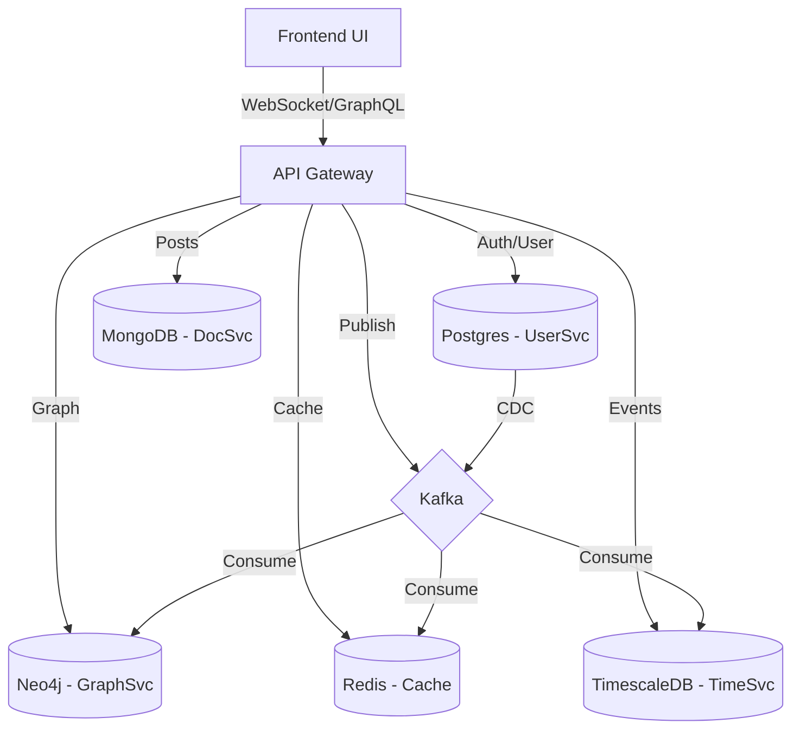

# Polyglot Persistence Demo

This project demonstrates a polyglot persistence system using Relational, Document, Graph, Time-series, and Key-value databases. It features a microservices architecture with a unified API gateway and a live visualization UI.

## Goals

- **Polyglot Persistence**: Showcase interaction between Postgres, MongoDB, Neo4j, TimescaleDB, and Redis.
- **Consistency Patterns**: Demonstrate strong vs. weak consistency.
- **Real-time Visualization**: Visualize data flow and state changes across services.
- **Event-Driven**: Use Kafka for event propagation.

## Architecture



### Services
- **Frontend**: React application for visualization.
- **API Gateway**: Node.js/Express service handling routing and orchestration.
- **User Service**: PostgreSQL for user data (Strong consistency).
- **Document Service**: MongoDB for posts and comments.
- **Graph Service**: Neo4j for social relationships.
- **Time-series Service**: TimescaleDB for analytics events.
- **Cache**: Redis for session and profile caching.
- **Message Broker**: Kafka for event bus.

## Project Structure

```
.
├── docker-compose.yml      # Orchestration for all services and databases
├── database.sql            # Postgres initialization script
├── TimeScaleDB.sql         # TimescaleDB initialization script
├── posts.json              # Sample data for MongoDB
├── services/
│   ├── api/                # Node.js Backend API
│   └── frontend/           # React Frontend
└── README.md               # Project documentation
```

## Getting Started

### Prerequisites
- Docker Desktop installed and running.

### Installation & Run

1.  **Clone the repository** (if applicable).
2.  **Start the application**:
    ```bash
    docker-compose up --build
    ```
    This command will:
    - Build the API and Frontend images.
    - Start all database containers (Postgres, Mongo, Neo4j, TimescaleDB, Redis).
    - Start Kafka and Zookeeper.
    - Initialize databases with provided SQL scripts.

3.  **Access the Services**:
    - **Frontend UI**: [http://localhost:3000](http://localhost:3000)
    - **Backend API**: [http://localhost:4000](http://localhost:4000)
    - **Kafka Connect**: [http://localhost:8083](http://localhost:8083)

## Data Schemas

### PostgreSQL (Users)
```sql
CREATE TABLE users (
  id UUID PRIMARY KEY DEFAULT gen_random_uuid(),
  email TEXT UNIQUE NOT NULL,
  name TEXT,
  hashed_password TEXT NOT NULL,
  created_at TIMESTAMP WITH TIME ZONE DEFAULT now(),
  updated_at TIMESTAMP WITH TIME ZONE DEFAULT now()
);
```

### MongoDB (Posts)
```json
{
  "author_id": "uuid",
  "title": "Post Title",
  "body": "Content...",
  "tags": ["tag1"],
  "meta": { "likes": 0 }
}
```

### Neo4j (Graph)
- **Nodes**: `(:User {id, name})`
- **Relationships**: `(:User)-[:FOLLOWS]->(:User)`

### TimescaleDB (Events)
```sql
CREATE TABLE events (
  time TIMESTAMPTZ NOT NULL,
  user_id UUID,
  event_type TEXT,
  properties JSONB
);
```

## Implementation Status

- [x] Docker Compose setup
- [x] Database initialization scripts
- [x] Basic Service Structure (API & Frontend)
- [ ] Full API Implementation
- [ ] Full Frontend Visualization
- [ ] Kafka Integration