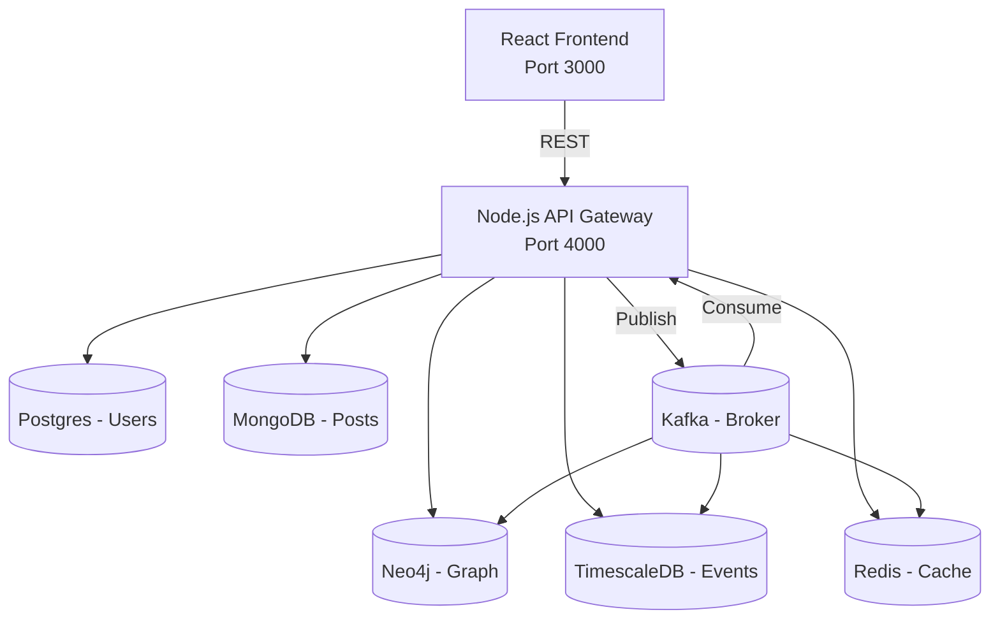

# Polyglot Persistence Demo

**Final Implementation & Architecture Review**

- Date: December 8, 2025
- Status: Project Complete (production-ready)

---

## Agenda

- Project Goals & Motivation
- Architecture Overview
- Databases & Why Each Was Chosen
- API & Event-Driven Flow
- Kafka: Producers & Consumers (full implementation)
- Frontend: Visualization (vis-network)
- Deployment & Run Instructions
- Demos & Test Cases
- Results, Metrics, and Next Steps

---

## Slide Notes

Speaker notes are attached below each slide (prefixed with "Note:"). Use them during the presentation.

---

## Project Goals & Motivation

- Demonstrate polyglot persistence: use multiple specialized DBs in a single system
- Show event-driven synchronization via Kafka
- Provide real-time visualization and analytics
- Build maintainable, modular code that can be deployed in containers


Note:
- Emphasize trade-offs between specialized DBs and the motivation for picking each.

---

## High-Level Architecture



Note:
- Walk through the diagram slowly: UI -> API -> DB writes, and explain Kafka's place in syncing and analytics.

---

## Databases & Rationale

- PostgreSQL (Users): ACID, strong consistency, relational queries
- MongoDB (Posts): Flexible schema, documents for content
- Neo4j (Graph): Native graph queries and visualization
- TimescaleDB (Events): Time-series optimized analytics
- Redis (Cache): Low-latency reads and profile caching

Note:
- Mention how each DB addresses specific requirements.

---

## API: Modular Structure

File structure (high level):

```
services/api/
├─ index.js           # App init, db setup, kafka init
├─ lib/
│  ├─ helpers.js      # asyncHandler, client getters
│  └─ kafka-consumers.js # Kafka consumers and event handlers
└─ routes/
   ├─ users.js
   ├─ posts.js
   ├─ graph.js
   ├─ analytics.js
   └─ cache.js
```

Note:
- Explain benefits: separation of concerns, testability, easier maintenance.

---

## API Endpoints Overview

- `POST /users`  — create user (sync to Neo4j + publish USER_CREATED)
- `GET /users`   — list users
- `PUT /users/:id` — update user (publish USER_UPDATED)
- `DELETE /users/:id` — delete user (publish USER_DELETED)

- `POST /posts`  — create post (publish POST_CREATED)
- `GET /posts`   — get posts (enriched with user data)

- `POST /follow` — create follow (Neo4j + publish FOLLOW_CREATED)
- `GET /relationships` — list relationships

- `GET /analytics` — TimescaleDB stats
- `GET /cache-status` — Redis metrics

Note:
- Highlight how endpoints publish events and how consumers handle them.

---

## Event Topic: `db-changes`

Event schema (JSON):

```json
{
  "type": "USER_CREATED",
  "data": { /* event-specific payload */ }
}
```

Handled event types:
- USER_CREATED / USER_UPDATED / USER_DELETED
- POST_CREATED / POST_UPDATED / POST_DELETED
- FOLLOW_CREATED

Note:
- Mention backward-compatibility and versioning considerations for topics (future improvement).

---

## Kafka Consumers — What We Implemented

`services/api/lib/kafka-consumers.js` implements handlers:

- TimescaleDB logging for all events
- Redis caching of user profiles (1 hour TTL) on USER_CREATED/UPDATED
- Redis deletion on USER_DELETED
- Neo4j node deletion on USER_DELETED (DETACH DELETE)
- Logging and safe handling for post/follow events

Note:
- Emphasize idempotency (consumer should be safe if message reprocessed).

---

## Code Snippet — Consumer Example

```javascript
await consumer.run({
  eachMessage: async ({ message }) => {
    const { type, data } = JSON.parse(message.value.toString());
    switch (type) {
      case 'USER_CREATED':
        await handleUserCreated(data, tsPool, redisClient);
        break;
      // ... other handlers
    }
  }
});
```

Note:
- Explain error handling and logging strategy inside the consumer.

---

## Frontend: Graph Visualization (vis-network)

- Replaced `react-force-graph` with `vis-network` to avoid A-Frame dependency
- `GraphSection.jsx` uses `vis-network` Network for interactive nodes and edges
- Features: zoom/pan, physics layout, click handlers for node details

Note:
- Mention performance benefits and ease of integration with DOM-based events.

---

## Deployment & Docker

- `docker-compose.yml` orchestrates 10 services:
  - zookeeper, kafka, postgres, timescaledb, mongo, neo4j, redis, kafka-connect, api, frontend
- Health checks ensure DB readiness before API startup

Quick start (PowerShell):

```powershell
cd "c:\path\to\Advanced-Database-Project"
docker-compose up -d
```

Note:
- Explain environment variables for DB connection strings and Kafka broker.

---

## Demo Plan (Suggested)

1. Start the stack with Docker Compose
2. Open Frontend at `http://localhost:3000`
3. Create a user via UI (or curl)
4. Show Neo4j Browser — user node created
5. Create a post — show enrichment (post has user info)
6. Create a follow relationship — show graph update
7. Show TimescaleDB analytics endpoint results
8. Show Redis cache status endpoint

Note:
- These steps demonstrate both sync and async flows.

---

## Testing & Validation

- Unit tests (recommended): Jest for API unit logic
- Integration tests: Supertest for endpoints, use test containers
- E2E tests: Cypress to validate UI + API flows
- Load tests: k6 for event throughput

Note:
- Mention importance of idempotence for consumers during retries.

---

## Results & Metrics (Observed)

- Neo4j nodes created on user creation
- TimescaleDB receives event logs for each CRUD operation
- Redis caches profiles with expected TTL
- UI updates reflect graph changes within seconds

Note:
- If available, include example metrics (QPS, event latency). If not, request user to provide sample runs.

---

## Security & Hardening (Recommendations)

- Add JWT-based authentication and RBAC
- Secure Kafka with TLS and authentication
- Enable DB backups and retention for TimescaleDB
- Rate-limit APIs and add monitoring/alerts

Note:
- These are next steps for production readiness.

---

## Future Work & Enhancements

- WebSocket / realtime push to frontend
- Recommendation engine using Neo4j + graph algorithms
- Add OpenAPI spec and generate client
- Kubernetes deployment + Helm chart
- Observability: Prometheus + Grafana dashboards

Note:
- Suggest prioritization options depending on time/budget.

---

## Appendix: Commands & Conversion

### Convert this Markdown to Reveal.js HTML

```bash
# Using reveal-md (quick preview)
npm install -g reveal-md
reveal-md docs/Polyglot_Persistence_Presentation.md --open
```

### Convert to PowerPoint via Pandoc (needs templates)

```bash
# Install pandoc and a pptx reference if needed
pandoc docs/Polyglot_Persistence_Presentation.md -t pptx -o Polyglot_Persistence_Presentation.pptx
```

Note:
- `pandoc` conversion may need minor template tweaks for speaker notes; reveal-md is recommended for interactive sessions.

---

---

## Acknowledgements

We would like to express our sincere gratitude to everyone who made this project possible.

- **Professor [Professor Name]** — for continuous mentorship, thoughtful guidance, and encouragement throughout the course of this project.
- **Southeast Missouri State University** — for providing academic resources and infrastructure that supported our development and testing efforts.
- **Advisors, TAs, and Faculty** — for constructive feedback, code reviews, and technical advice.
- **Project Team Members** — Paras Tiwari, Nischal Neupane, and Sandhya Shahi Thakuri: for dedication, collaboration, and shared problem-solving.
- **Family and Friends** — for patience and moral support during tight deadlines.
- **Open-source communities and tool maintainers** — thank you to contributors of Node.js, Express, React, Kafka, PostgreSQL, MongoDB, Neo4j, TimescaleDB, Redis, and other libraries.

Note:
- This project reflects a collective effort; your mentorship, ideas, and support were invaluable.

---

## Appendix: Files & Resources

- `services/api/lib/kafka-consumers.js` — event handlers
- `services/api/routes/*` — modular route handlers
- `services/frontend/src/components/GraphSection.jsx` — vis-network integration
- `README.md`, `PROJECT_REPORT.md`, `FINAL_SUMMARY.md`, `IMPLEMENTATION_COMPLETE.txt`

---

# Thank you

Questions?

Note:
- Offer to run a live demo or export the deck to PPTX/PDF on request.

